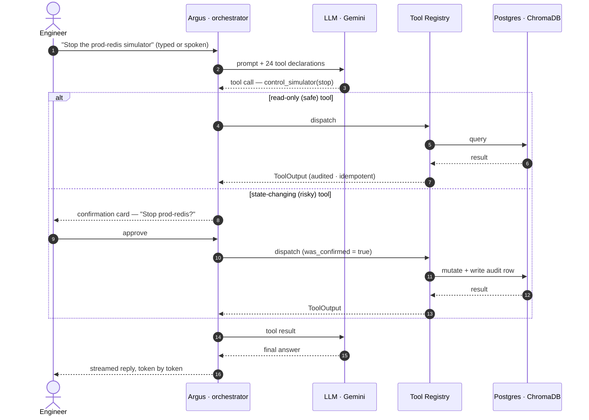
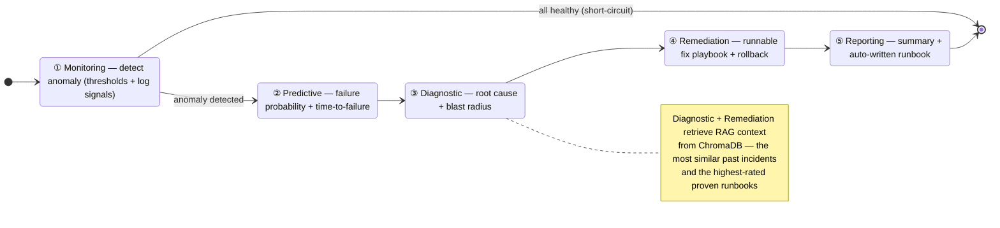
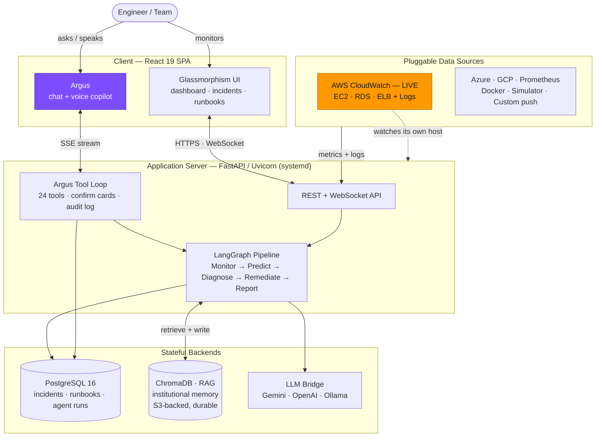
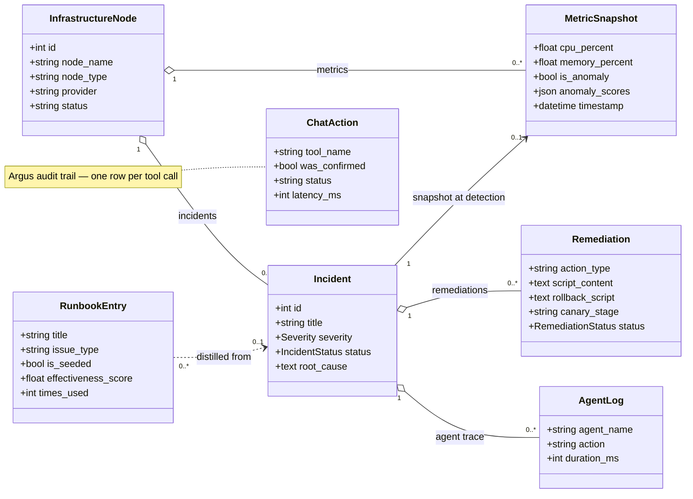
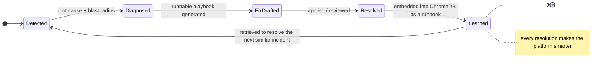
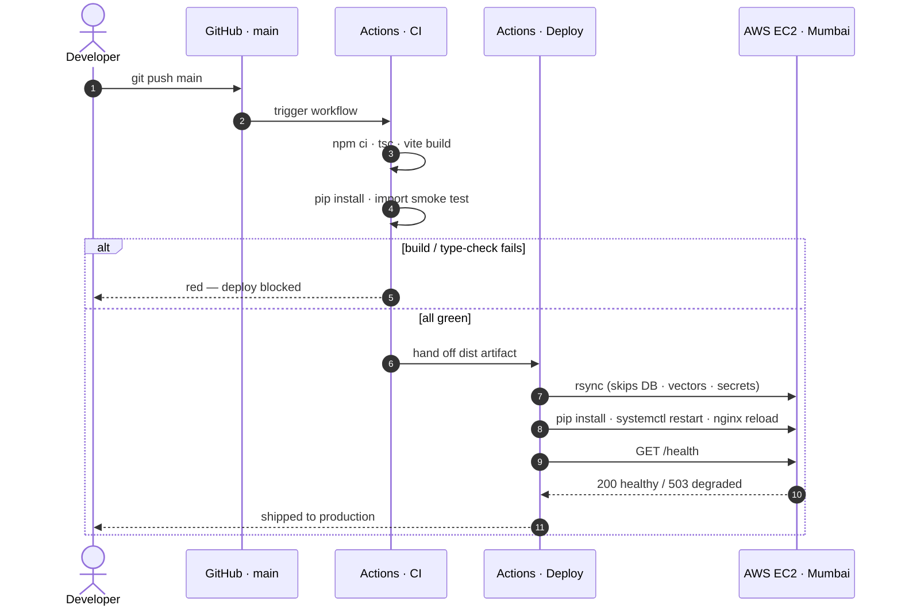

# DYNAMIC IT OPERATIONS ORCHESTRATOR

### Autonomous Multi-Agent AIOps Platform for Self-Healing Enterprise

*Five autonomous AI agents and a conversational copilot that watch your fleet, predict failures before they land, diagnose root cause, draft safe fixes, and remember every resolution — so infrastructure heals itself and on-call engineers get their nights back.*

 

 

  

**<a href="https://dynamic-it-ops.tankbusters.duckdns.org/" target="_blank" rel="noopener noreferrer">Live App</a>** &nbsp;·&nbsp; **<a href="https://dynamic-it-ops.tankbusters.duckdns.org/docs" target="_blank" rel="noopener noreferrer">Interactive API (Swagger)</a>** &nbsp;·&nbsp; **<a href="https://dynamic-it-ops.tankbusters.duckdns.org/health" target="_blank" rel="noopener noreferrer">Component Health</a>**

 

 

**Team Tank Busters** · P. Shiva Santhosh · N. S. J. S. Dhanush · P. Shikhar

---

## 🛰️ Live — and watching real cloud infrastructure right now

This platform is connected to **real AWS CloudWatch** in **Mumbai (`ap-south-1`)** and is monitoring a **production EC2 instance — the very host it is deployed on.**

It reads that instance's live CPU, network, and status-check metrics straight from CloudWatch, tails its real log groups (`/itops/ec2/syslog`, `/itops/ec2/auth`), and runs the full five-agent pipeline against what it actually observes. In other words: **the orchestrator watches the infrastructure it lives on, and would diagnose and draft a fix for its own host the moment something drifts.**

That same first-class connector layer plugs straight into **Azure Monitor, GCP Cloud Monitoring, Prometheus, and Docker** — switchable from the UI, no code changes. AWS is simply the one we wired to a live account so you can watch the whole loop work today, on genuine cloud telemetry.

> Connect your own cloud in under a minute: drop in credentials on the **Data Sources** page, point it at your instances, and the agents start reasoning over *your* fleet immediately.

---

## The Problem

Modern enterprises run thousands of services across AWS, GCP, Azure, and on-prem clusters. The tooling that watches them was built to **alert**, not to **act**. So when something breaks at 3 AM:

- A dozen siloed monitors all fire at once — none of them coordinate, and the on-call engineer drowns in **alert fatigue** before the real signal surfaces.
- Triage is manual archaeology: scroll dashboards, grep logs, hunt Slack for whoever last touched this service, dig through a runbook that's six months stale.
- A trivial fix that took five minutes last quarter takes forty-five tonight, because **no system remembers** how it was solved. Institutional knowledge walks out the door with every engineer who leaves.
- By the time a human understands what's happening, the blast radius has already spread — and that translates directly into **SLA breaches, lost revenue, and burned-out teams.**

The cost isn't only technical. It's the pager that goes off during dinner, the weekend that evaporates, the slow erosion of a team that never gets to stop firefighting. **Mean-time-to-resolution (MTTR) is a human problem dressed up as a metric.**

And here's the deeper truth: **one AI model alone can't fix this.** Detecting an anomaly, forecasting a failure, reasoning about root cause, and producing a *safe* remediation are fundamentally different cognitive tasks. They need specialized agents that collaborate — an **agentic architecture** — not a single prompt doing everything badly.

## The Solution

**Dynamic IT Operations Orchestrator** is an autonomous **AIOps** platform that closes the loop from *detection* to *resolution* to *memory*.

Five specialized agents — coordinated by a **LangGraph** state machine — observe the fleet continuously, forecast failures before impact, diagnose root cause using **retrieval-augmented memory** of every past incident, generate production-grade remediation playbooks with rollback safety, and capture each resolution as a reusable runbook. Sitting on top of all of it is **Argus**, a conversational copilot you can *talk* to: ask anything about your fleet, or tell it to act, in plain English or with your voice.

Every incident the platform resolves makes it smarter. The knowledge base grows itself. The 3 AM page becomes a 3 AM **non-event** — handled, documented, and already understood by the time anyone wakes up.

**That's the real deliverable: not a dashboard, but peace of mind.**

---

## Meet Argus — Your Fleet, in Plain Words

> *"Stop reading dashboards. Start asking Argus."*

**Argus** is the platform's conversational SRE copilot — named after **Argus Panoptes**, the hundred-eyed watchman of Greek myth who never fully slept. You reach the entire platform through a single, natural conversation: **type it, or just speak it.**

- **Anyone on the team can drive it.** You don't need to know which dashboard to open, which metric to chart, or a single CLI flag. You ask in your own words — *"Which nodes are critical right now?"*, *"Why is prod-api-2 unhealthy?"*, *"Run the pipeline on every degraded node and walk me through it"* — and Argus does the rest. An incident commander, a team lead, or someone in their first week can operate the fleet with equal confidence.
- **It doesn't just answer — it acts.** Argus is backed by **24 real tools** spanning the whole platform: fleet health and metrics, live logs, incidents, the agent pipeline, runbooks, data-source connections, simulators, and runtime settings. It reads live state and *performs operations* on your behalf.
- **Safe by design — review-first.** Anything that changes state (deleting a runbook, reconnecting a data source, stopping a simulator) is shown to you as a **confirmation card** *before* a single thing runs. Nothing irreversible happens behind your back. Every action Argus takes is written to a tamper-evident **audit log**, and repeated calls within a turn are **idempotent** — so a fix can never accidentally double-fire.
- **Speak naturally — even the jargon.** Push-to-talk voice input is tuned for the way engineers actually talk: it auto-corrects the SRE and cloud terms speech recognizers mangle (*"cube cuddle" → `kubectl`*, *"easy two" → `EC2`*, *"post grass" → `Postgres`*) and is calibrated for Indian-English speakers out of the box.
- **It knows the craft, not just your data.** Beyond your fleet, Argus answers general SRE/DevOps questions — what an OOM kill means, how to think about a connection-pool exhaustion, what MTTR really measures — and politely declines anything off-topic, so it stays a focused operations expert.
- **It writes runbooks *with* you.** Ask Argus to author a runbook and it drafts the whole thing — problem pattern, root cause, causal chain, blast radius, remediation steps with shell scripts and rollback — then hands you a pre-filled form to review, edit, and save. You stay in control; Argus does the typing.

Argus is the leftmost, highlighted item in the navigation for a reason: it's the fastest way to operate the entire platform.

### How a request flows through Argus

The sequence below traces a single instruction — including the safety branch that pauses any state-changing tool on a confirmation card before it runs.

---

## The Five Autonomous Agents

A request flows through a **LangGraph** state machine — a stateful, fault-tolerant graph where each agent is a node and shared context accumulates as it executes. The graph short-circuits intelligently: if the Monitoring agent sees no anomaly, the pipeline ends immediately and nothing downstream wastes a cycle.

| Agent | Role | Intelligence Stack |
|:---|:---|:---|
| **Monitoring** | Real-time anomaly detection across CPU, memory, disk, network, latency, and error rate, correlated with live log-pattern signals | Deterministic threshold engine · log pattern matching · LLM for context |
| **Predictive** | Failure-probability forecasting, time-to-failure estimation, escalation- and cascade-risk scoring | Trend analysis · EWMA scoring · LLM reasoning over metric history |
| **Diagnostic** | Root-cause analysis, causal-chain mapping, blast-radius assessment | Known-issue profiles · **RAG** over past incidents · LLM causal reasoning |
| **Remediation** | Generates executable, **reviewable** fix playbooks — shell scripts with validation steps and rollback commands, downloadable per artifact | Pre-approved templates · **RAG** over proven fixes · LLM |
| **Reporting** | Executive summaries, incident timelines, SLA impact, and an **auto-generated runbook** written back to memory | Structured summarization · writes to the vector store |

### Fast path first, LLM only when it earns its keep

- **Common failure modes** — memory leaks, CPU spikes, disk-full, network saturation — resolve **instantly** through pre-approved response profiles. No model latency, no token cost.
- **Novel anomalies** invoke the LLM, which is handed **RAG context** retrieved from the most similar past incidents and the highest-rated runbooks — so it reasons from your fleet's actual history, not generic priors.
- **Graceful by default.** If the LLM provider is unavailable, the pipeline degrades to safe deterministic defaults — **it never breaks the loop.** Each agent node is timeout-bounded and falls back to a partial result rather than failing the whole run.
- **Storm-proof.** A configurable concurrency cap and per-node cooldown protect the database and event loop, so an anomaly storm can never spawn unbounded work.

### Remediation you can trust

The Remediation agent produces **production-grade, runnable playbooks** — real shell scripts with explicit validation and rollback steps, each downloadable as an artifact. This is **deliberate, safe-by-default AIOps**: the platform does the hard reasoning and hands a vetted, reversible fix to a human (or to Argus, behind a confirmation card) to apply. No AI silently running destructive commands against production — exactly the boundary a mature operations team wants. Wiring execution to live SSH, Ansible, Terraform, or cloud-API targets is a drop-in integration at the executor seam.

---

## How It All Fits Together

A component view of the running system — the client, the application server, the stateful backends, and the pluggable data sources that feed it.

Every resolved incident is embedded and written back into ChromaDB. The next time a similar symptom appears, the Diagnostic and Remediation agents retrieve it — so **the platform compounds its own expertise with every failure it sees.**

### Core domain model

The persistent entities and how they relate. Note the closing loop: a `RunbookEntry` can be distilled from the very `Incident` it later helps resolve, and `ChatAction` is Argus's append-only audit trail.

---

## Pluggable by Design

Data sources, LLM providers, and remediation profiles are all interface-driven. The agents never know — or care — where a metric came from or which model is reasoning. Swap any layer without touching the pipeline.

| Platform | Status | Surface |
|:---|:---:|:---|
| **AWS CloudWatch** | **Connected · live** | EC2 · RDS · ELB metrics + CloudWatch Logs |
| **Azure Monitor** | First-class adapter | VM · SQL · App Service |
| **GCP Cloud Monitoring** | First-class adapter | Compute Engine · Cloud SQL |
| **Prometheus** | First-class adapter | PromQL · Node Exporter |
| **Docker** | First-class adapter | Container stats via daemon API |
| **Built-in Simulator** | Active | Full multi-tier fleet with realistic diurnal patterns |
| **Custom JSON Push** | Active | Ingest metrics from anywhere over a single REST endpoint |

**LLM providers are switchable at runtime** — Google **Gemini 2.5 Flash**, **OpenAI GPT-4o**, or fully local **Ollama** — chosen from the Settings page with no restart. Per-agent temperatures are independently tunable (lower for critical ops, higher for narrative reporting), and the system auto-rotates to a backup Gemini key on rate-limit pressure.

The **built-in simulator** runs a realistic production fleet — load balancers, app servers, databases, caches, and message queues — and injects six true-to-life failure modes (**memory leak, CPU spike, disk-fill, network saturation, connection-pool exhaustion, and cascading failure**), so the entire incident lifecycle is demoable end-to-end without provisioning a single real server.

---

## Institutional Memory — The Platform That Never Forgets

The knowledge base is a **ChromaDB** vector store (HNSW index, cosine similarity) that turns every resolution into searchable, reusable expertise. Embeddings are generated by your provider of choice (Gemini's `text-embedding-004` or local Ollama `nomic-embed-text`), with a hard timeout that degrades gracefully so an unreachable embedding service can never stall the app.

- **Every resolved incident becomes a runbook**, written back automatically by the Reporting agent.
- **Canonical, battle-tested runbooks ship seeded** for the most common failure modes — so the platform is useful on day one, before it has even seen its first incident.
- **Spotted a failure mode we don't cover yet?** Add your own. If you've fought a battle the platform hasn't — a Kafka consumer-lag meltdown, an SSL-expiry outage, a thread-pool starvation — author a runbook for it and it joins the institutional memory the agents draw on. Better yet, **ask Argus to draft it for you** from a quick description; you review, refine, and save.

The result: knowledge stops evaporating when people move on. It accumulates.

### The learning loop

---

## The Experience

A custom **glassmorphism** design system — built with React 19, Tailwind CSS 4, Framer Motion, and Recharts — makes a deeply technical platform feel calm and effortless to operate.

- **Dashboard** — real-time fleet health, live metric charts streamed over WebSocket, an incident ticker, and a one-tap path to Argus.
- **Pipeline** — run the full agent pipeline on any node and watch each step report progress live.
- **Incidents** — complete history with root cause, blast radius, remediation playbooks, and per-artifact script downloads.
- **Infrastructure** — node inventory with drill-down metric history and status at a glance.
- **Data Sources** — connect a cloud provider in under a minute, test the connection, and watch nodes appear.
- **Simulators** — create, control, and fault-inject simulated nodes for demos and testing.
- **Runbooks** — the growing knowledge base, fully browsable, searchable, and authorable.
- **Argus** — the full-screen conversational copilot, with voice.
- **Settings** — switch LLM provider, tune per-agent behavior, and toggle the autonomous pipeline, all at runtime.

Full, interactive API reference (Swagger UI) is always live at **<a href="https://dynamic-it-ops.tankbusters.duckdns.org/docs" target="_blank" rel="noopener noreferrer">`/docs`</a>** — every endpoint, schema, and example, ready to try in the browser.

---

## Built for Production — Infrastructure, and Why

Production runs from a single, cost-optimized AWS region (**Mumbai · `ap-south-1`**, chosen for the lowest latency to our users). The entire stack — reverse proxy, API, database, and vector store — runs on **one Graviton instance** for roughly **$15/month all-in**, with durable cloud-backed memory and zero-downtime deploys. Lean by intent, not by limitation.

**Live at <a href="https://dynamic-it-ops.tankbusters.duckdns.org/" target="_blank" rel="noopener noreferrer">`dynamic-it-ops.tankbusters.duckdns.org`</a>.**

### The AWS footprint — and the reasoning behind each piece

| Resource | What it is | Why this choice |
|:---|:---|:---|
| **EC2 `t4g.small` (Graviton/ARM)** | The single app host: nginx, FastAPI, PostgreSQL, ChromaDB, cert renewal | ARM Graviton gives the best price/performance at this tier; one box keeps latency in-loopback and the bill tiny |
| **S3 bucket + IAM instance role** | Durable home for the ChromaDB vector store, mounted via **S3 Files** at `/mnt/s3/itops` | **Institutional memory survives instance replacement** — rebuild the box and the agents keep every lesson learned. Least-privilege IAM (read/write to one bucket), with automatic fallback to local EBS if the mount isn't ready |
| **Encrypted `gp3` EBS (30 GB)** | App code + Postgres data directory | Encrypted at rest; `gp3` is cheaper and faster than `gp2` at this size |
| **Elastic IP** | Stable public IPv4 | Survives restarts; the DNS A record never has to chase a changing address |
| **Security Group** | Stateful firewall, inbound `22 / 80 / 443` only | Everything else is loopback-only inside the box — minimal attack surface |
| **IMDSv2 (required)** | Token-authenticated instance metadata | Defends against SSRF-based metadata exfiltration — modern AWS hardening baseline |
| **AWS Budgets ($20/mo alert)** | Spend guardrail at 80% actual / 100% forecast | Cost governance built in — no surprise bills, ever |

### What runs on the box

**Nginx** terminates TLS and serves the React build, reverse-proxying the API and WebSocket — one front door, no load balancer needed. **FastAPI/Uvicorn** runs under **systemd** supervision (auto-restart, journald logging, ordered start after Postgres). **PostgreSQL 16** is co-located as the durable store for incidents, runbooks, and agent runs. **ChromaDB** powers RAG, persisted to the S3-backed mount. A **cron-driven `acme.sh`** keeps TLS certificates fresh automatically.

### DNS & TLS

Free, automatic HTTPS via **DuckDNS** (dynamic DNS → Elastic IP) and **ZeroSSL** certificates issued by `acme.sh` over an HTTP-01 challenge, auto-renewing on a daily cron with an nginx reload hook. TLS 1.2/1.3 only, with a hardened cipher policy and a 301 redirect from `:80`.

### What we deliberately *don't* run — and why

Knowing what to leave out is its own discipline. Each of these was a conscious call, not an oversight:

- **No RDS** — a co-located PostgreSQL handles this workload's concurrency comfortably and saves ~$15/mo.
- **No ALB/NLB** — a single instance with nginx as the front door needs no load balancer (~$16/mo saved).
- **No NAT Gateway** — a single public subnet is sufficient (~$30/mo saved).
- **No CloudFront** — the gzipped React bundle is ~1 MB; nginx serves it directly.
- **No Secrets Manager** — credentials live in a root-only `EnvironmentFile` (mode `600`) loaded by systemd, kept entirely out of the app deploy path.

The whole production footprint is **one EC2 instance, one Elastic IP, one EBS volume, and one S3 bucket** — verified by a cross-region account scan.

### Ship on every push — CI/CD

Every push to `main` runs the same gated pipeline. A red build never reaches production, and the health gate confirms the box is serving before the deploy is called done.

**Zero-downtime, zero-data-loss deploys.** The deploy `rsync` explicitly excludes the database, vector store, and secrets, so user state and credentials survive every release untouched. Workflow concurrency control prevents in-flight deploys from stomping each other. A live **<a href="https://dynamic-it-ops.tankbusters.duckdns.org/health" target="_blank" rel="noopener noreferrer">`/health`</a>** probe reports the database, vector store, every background task, and Argus's registered tool count individually — flipping to `503` the instant any subsystem degrades, ready to pull the box from rotation.

---

## Tech Stack

| Layer | Technology |
|:---|:---|
| **Copilot** | Argus — function-calling tool loop · streaming SSE · push-to-talk voice (Web Speech API) |
| **Frontend** | React 19 · TypeScript · Vite · Tailwind CSS 4 · Framer Motion · Recharts · React Router 7 |
| **Backend** | FastAPI · Uvicorn · SQLAlchemy 2 · Pydantic 2 · asyncio · WebSockets |
| **Orchestration** | LangChain · **LangGraph** state machine |
| **LLM Providers** | Google Gemini 2.5 Flash · OpenAI GPT-4o · Ollama (local) — **switchable at runtime** |
| **Memory / RAG** | **ChromaDB** (HNSW, cosine) · embeddings via Gemini `text-embedding-004` or Ollama `nomic-embed-text` |
| **Database** | **PostgreSQL 16** (production) · SQLite (dev fallback) · SQLAlchemy 2 ORM |
| **Cloud Connectors** | AWS (boto3) · Azure Monitor · GCP Cloud Monitoring · Prometheus · Docker |
| **Deploy** | AWS EC2 (Amazon Linux 2023, Graviton/ARM) · S3 + IAM · Nginx · systemd · GitHub Actions CI/CD |
| **TLS / DNS** | ZeroSSL via `acme.sh` (auto-renew) · DuckDNS dynamic DNS |

---

## Engineering Highlights — Depth Under the Hood

The parts worth a closer look when you want to gauge engineering maturity:

- **Real, hardened CloudWatch integration** — validates credentials on connect, polls EC2/RDS/ELB, tails CloudWatch Logs incrementally with a per-instance high-water mark, retries transient errors while failing fast on permanent auth errors, and **filters its own log output to break self-monitoring feedback loops.**
- **Trustworthy agentic actions** — Argus writes every tool call to an audit log, enforces **idempotency** per conversation turn (a mutating action can't double-fire), validates all LLM-supplied arguments against strict schemas (`extra="forbid"`), and pauses risky tools on a confirmation card before execution.
- **Bounded async dispatch** — a semaphore plus a live-task set guarantees an anomaly storm can never spawn unbounded coroutines or lose tasks to garbage collection mid-flight.
- **Graceful degradation everywhere** — each LangGraph node is timeout-bounded and returns a partial result on failure; the embedding layer falls back to a zero vector after a hard timeout; the pipeline retries once on transient errors before giving up cleanly.
- **State-preserving deploys** — `rsync --delete` with explicit excludes keeps the vector store, database, and secrets across every release; production DB credentials live in a root-only systemd `EnvironmentFile`, never touched by deploys.
- **Cross-database engine config** — the session layer branches on the URL scheme: SQLite gets `check_same_thread=False`; Postgres gets a pre-tuned pool (`pool_pre_ping`, `pool_recycle`) so a stale connection never reaches a request.
- **Durable, portable memory** — the ChromaDB store is S3-backed in production, so institutional knowledge outlives any single instance.

---

## Enterprise Impact

| Outcome | Impact |
|:---|:---|
| **MTTR** | Minutes instead of hours — agents diagnose and draft validated fixes the moment an anomaly appears |
| **Downtime** | Cut sharply through predictive detection plus instant, reviewable remediation |
| **SLA adherence** | Proactive resolution heads off breaches before they happen |
| **Operator toil** | Auto-triage, auto-diagnosis, and conversational control collapse the bulk of the on-call workload |
| **Knowledge retention** | Every resolved incident enriches institutional memory — nothing is relearned, nothing walks out the door |
| **Peace of mind** | The 3 AM page becomes a 3 AM non-event — handled, documented, understood |

---

### Built by Team Tank Busters

**P. Shiva Santhosh** · **N. S. J. S. Dhanush** · **P. Shikhar**

*For the future of autonomous IT operations — where infrastructure heals itself, and the people who run it finally get to rest.*

 

