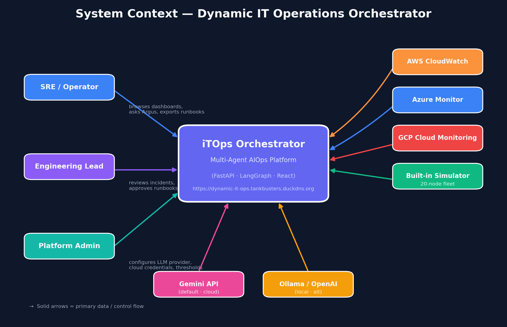
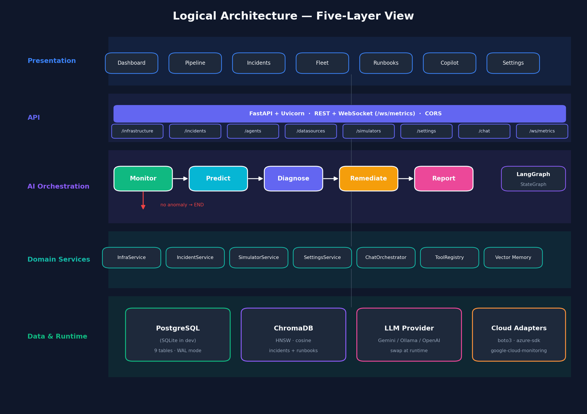
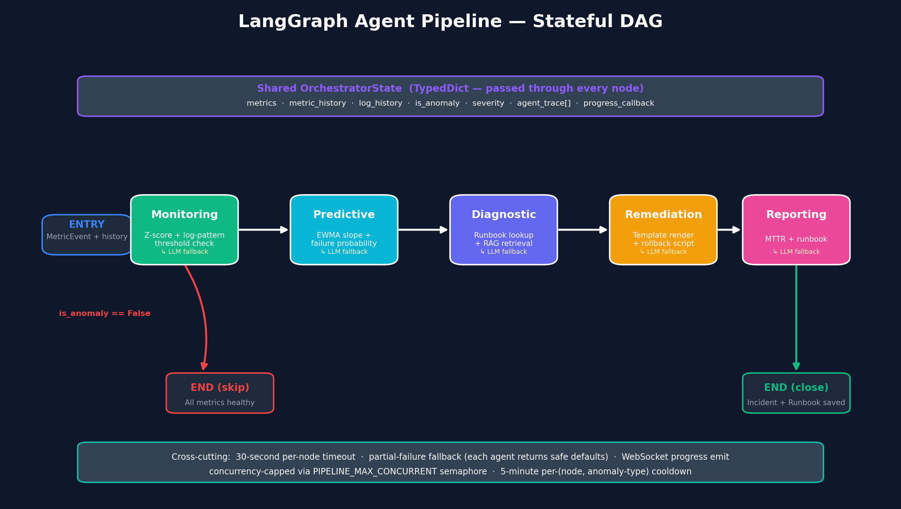
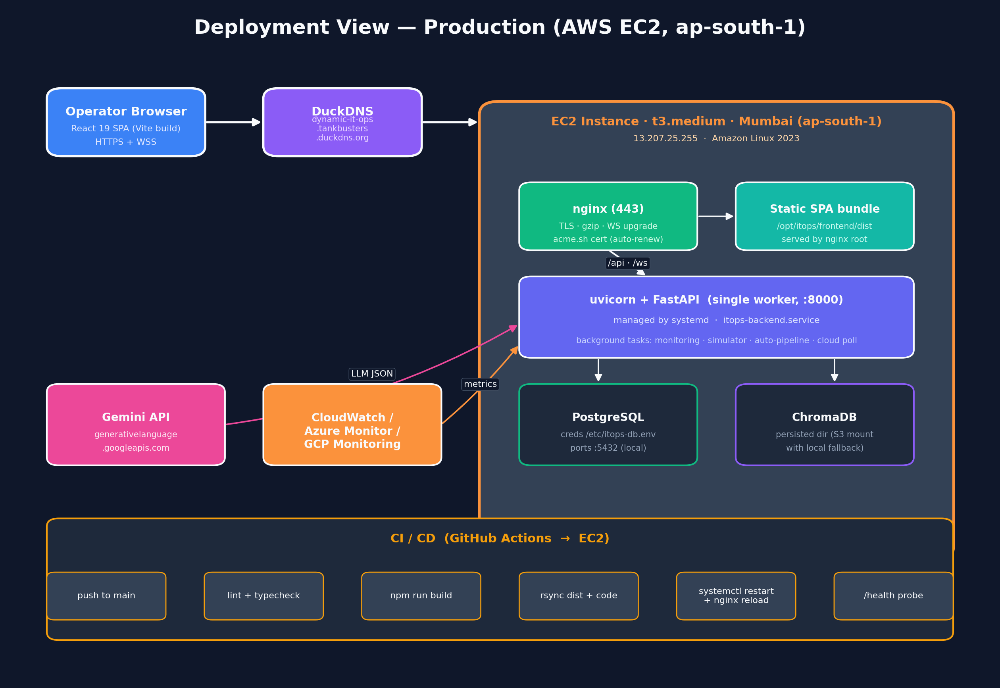
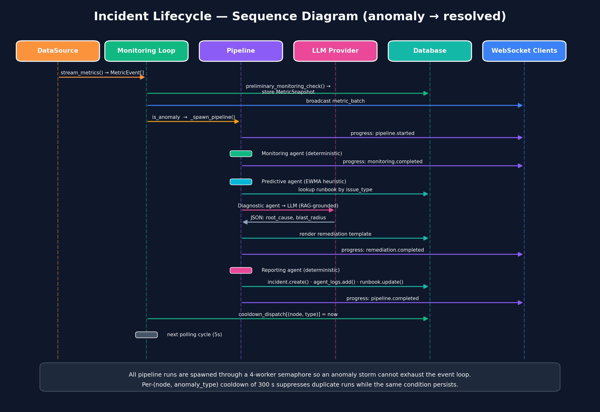
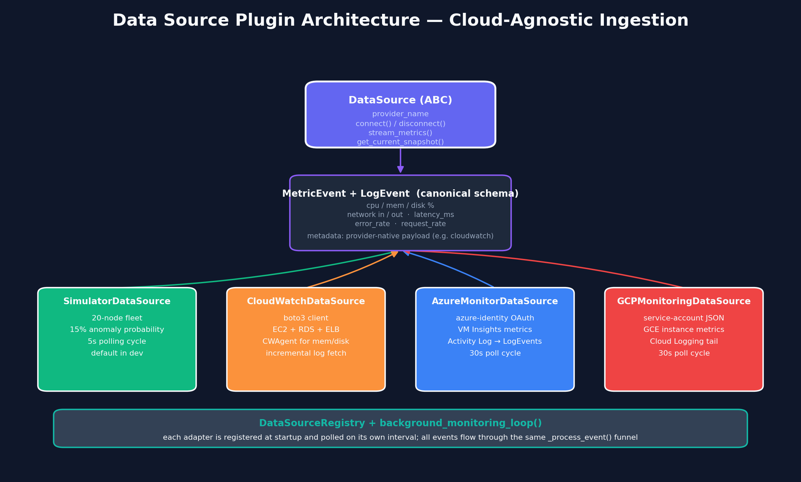
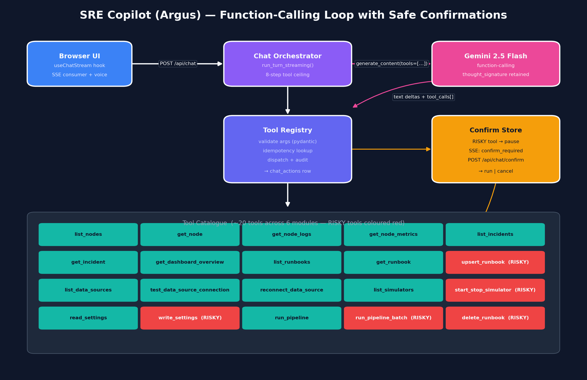
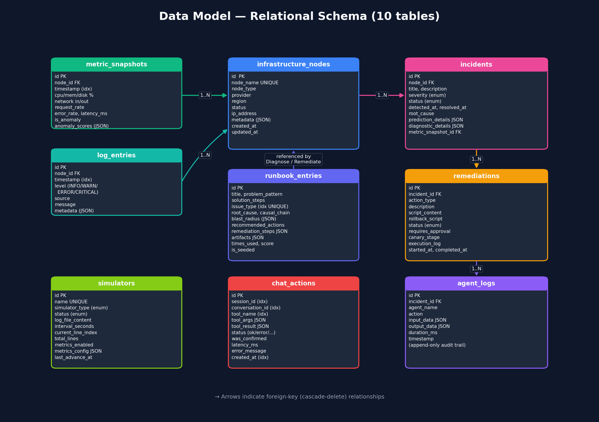

# Architecture Document
## Dynamic IT Operations Orchestrator
**Autonomous Multi-Agent AIOps Platform for Self-Healing Enterprise Infrastructure**

| | |
|---|---|
| **Team** | Tank Busters |
| **Members** | P. Shiva Santhosh · N. S. J. S. Dhanush · P. Shikhar |
| **Faculty Mentor** | E. Pragnavi |
| **Institution** | University College of Engineering, Osmania University |
| **Hackathon Stage** | Stage 3 — Production-Ready Proof of Concept |
| **Live Deployment** | https://dynamic-it-ops.tankbusters.duckdns.org |
| **Document Version** | 2.0 (supersedes v1.0) |
| **Date** | 2026-05-24 |

---

## Table of Contents

1. [Introduction](#1-introduction)
2. [Architectural Goals and Constraints](#2-architectural-goals-and-constraints)
3. [System Overview](#3-system-overview)
4. [Architecture Views](#4-architecture-views)
   - 4.1 [System Context (Level 0)](#41-system-context-level-0)
   - 4.2 [Logical / Layered View](#42-logical--layered-view)
   - 4.3 [LangGraph Pipeline DAG](#43-langgraph-pipeline-dag)
   - 4.4 [Process / Concurrency View](#44-process--concurrency-view)
   - 4.5 [Deployment View](#45-deployment-view)
   - 4.6 [Sequence View — Incident Lifecycle](#46-sequence-view--incident-lifecycle)
   - 4.7 [Data Source Plugin Architecture](#47-data-source-plugin-architecture)
   - 4.8 [SRE Copilot (Argus) — Function-Calling Flow](#48-sre-copilot-argus--function-calling-flow)
5. [Data Model](#5-data-model)
6. [Core Technical Services](#6-core-technical-services)
7. [Quality Attributes](#7-quality-attributes)
8. [Risks, Limitations, and Mitigations](#8-risks-limitations-and-mitigations)
9. [Alternatives Considered](#9-alternatives-considered)
10. [Changes Since v1.0](#10-changes-since-v10)
11. [Appendix](#11-appendix)
    - 11.1 [REST and WebSocket Surface](#111-rest-and-websocket-surface)
    - 11.2 [Performance Bounds (Measured)](#112-performance-bounds-measured)
    - 11.3 [Critical Components](#113-critical-components)
    - 11.4 [Glossary](#114-glossary)

---

## 1. Introduction

### 1.1 Purpose

This document describes the software architecture of the **Dynamic IT Operations Orchestrator**, a production-grade multi-agent AIOps platform that ingests fleet telemetry, classifies anomalies, predicts trajectory, attributes root cause from institutional memory, and emits an executable remediation plan — all within a single LangGraph pipeline that completes in well under a minute.

It is the v2 architecture document, replacing the Stage 2 PoC writeup. The platform now runs **24/7 on AWS** behind TLS at `dynamic-it-ops.tankbusters.duckdns.org`, supports **three live cloud telemetry sources** (CloudWatch, Azure Monitor, GCP Monitoring), is backed by **PostgreSQL + ChromaDB**, swaps between **three LLM providers** (Gemini, OpenAI, Ollama) at runtime, and ships an **SRE Copilot ("Argus")** that operates the platform itself through a streaming function-calling loop.

### 1.2 Scope

| Area | In scope |
|------|----------|
| Frontend | React 19 SPA with 11 pages, Recharts, Framer Motion, streaming chat (SSE) |
| Backend | FastAPI + Uvicorn, async event loop, 8 router modules, 4 background coroutines |
| AI orchestration | LangGraph 5-node `StateGraph` with conditional early-exit, per-node timeout, partial-failure containment |
| Memory | ChromaDB-backed institutional memory (HNSW + cosine), runbook auto-generation |
| LLM | Pluggable provider abstraction (`llm/provider.py`) — Gemini · OpenAI · Ollama |
| Data sources | Pluggable `DataSource` ABC — Simulator · AWS CloudWatch · Azure Monitor · GCP Cloud Monitoring |
| Copilot | Streaming Gemini function-calling loop with ~20 tools and risky-action confirmation |
| Deployment | EC2 (Mumbai) + nginx + systemd + GitHub Actions CI/CD |

### 1.3 Audience

Architecture reviewers, faculty evaluators, infrastructure engineers, SREs, and any contributor extending the platform.

---

## 2. Architectural Goals and Constraints

### 2.1 Goals

| # | Goal | How the architecture delivers it |
|---|------|----------------------------------|
| G1 | **Zero-touch routine remediation** | LangGraph pipeline closes the loop from raw metric to actionable script without human steps |
| G2 | **Sub-minute incident-to-plan** | Two-stage filter (deterministic → LLM), per-node 30 s timeout, semaphore-bounded concurrency |
| G3 | **Provider portability** | `llm/provider.py` unifies Gemini, OpenAI, Ollama behind one `chat_json()` call |
| G4 | **Cloud-agnostic telemetry** | `DataSource` ABC normalises every provider into `MetricEvent` / `LogEvent` |
| G5 | **Institutional learning** | Every resolved incident is embedded in ChromaDB; future runs use it as RAG context |
| G6 | **Runtime configurability** | Settings UI rewrites `runtime_settings.json` and routes reread it on every call — no restart |
| G7 | **Operational safety on autonomy** | Risky Copilot tools pause via `confirm_required` SSE event and resume only on operator approval |
| G8 | **Graceful degradation** | Every agent has a deterministic fallback; the pipeline never stalls on LLM failure |

### 2.2 Constraints

| # | Constraint | Implication |
|---|------------|-------------|
| C1 | Single-worker Uvicorn (pipeline run state is in-process) | Vertical-scale model — fine until state moves to Redis |
| C2 | One outbound LLM provider active at a time | Provider selection is global and runtime, not per-request |
| C3 | Free-tier API quotas (Gemini, OpenAI) | Backup-key rotation built into the provider layer |
| C4 | EC2 t3.medium (2 vCPU, 4 GB) | Concurrency cap of 4 pipelines via `PIPELINE_MAX_CONCURRENT` semaphore |
| C5 | No auth gate on the API yet | Architecture leaves middleware seams; production cutover documented in §8 |

---

## 3. System Overview

The Orchestrator's core lifecycle is short and self-contained:

```
metric event  →  deterministic precheck  →  is_anomaly?
                                              │
                            ┌─────────────────┴─────────────────┐
                            │                                   │
                          no                                  yes
                            │                                   │
                       store snapshot                  spawn pipeline ──►  Monitor ─► Predict ─► Diagnose ─► Remediate ─► Report
                            │                                                                                                   │
                            └────────►  broadcast over WS  ◄──────────  incident + runbook persisted, RAG updated ◄─────────────┘
```

Every event flows through the same `_process_event()` funnel regardless of source, so adding a fourth or fifth cloud is purely additive. Every LLM call has a deterministic fallback; every long-running call has a timeout; every duplicate dispatch is suppressed by a per-(node, anomaly-type) cooldown. The pipeline writes nothing to remote infrastructure — remediation is **generated, never executed** — which is what makes it safe to run continuously in production.

---

## 4. Architecture Views

### 4.1 System Context (Level 0)



Three human actors and four telemetry sources surround a single application. Two outbound LLM lanes (cloud and local) are interchangeable at runtime.

| Element | Role |
|---------|------|
| **SRE / Operator** | Watches dashboards, queries Argus, downloads remediation artifacts |
| **Engineering Lead** | Reviews incidents, curates and approves runbooks |
| **Platform Admin** | Rotates LLM provider, plugs in cloud credentials, tunes thresholds |
| **CloudWatch / Azure Monitor / GCP Monitoring** | Live production telemetry sources, polled on a 30 s cycle |
| **Built-in Simulator** | Default zero-config source, 20-node fleet, 15 % anomaly probability |
| **Gemini API** | Default cloud LLM with backup-key rotation on 429/503 |
| **Ollama / OpenAI** | Alternative providers, selected from Settings — Gemini, OpenAI key, or local Ollama URL |

### 4.2 Logical / Layered View



The system is partitioned into five layers with strict dependency direction (upper layers depend on lower; never the reverse).

| Layer | Responsibility | Tech |
|-------|----------------|------|
| **Presentation** | 11 React pages, real-time WS hook, SSE-streamed chat, voice input | React 19 · Vite · TailwindCSS v4 · Framer Motion · Recharts |
| **API** | 8 routers, single WebSocket, CORS, dependency-injected DB sessions | FastAPI 0.115 · Uvicorn (single worker) |
| **AI Orchestration** | LangGraph `StateGraph`, conditional edges, per-node timeout, progress callbacks | LangGraph 0.2 · LangChain Core 0.3 |
| **Domain Services** | Service classes that own all DB / vector-store IO and business invariants | SQLAlchemy 2 · plain async Python |
| **Data & Runtime** | Relational store, vector store, LLM provider, cloud adapters | PostgreSQL · ChromaDB · Gemini / Ollama / OpenAI · boto3 / azure-sdk / gcloud |

### 4.3 LangGraph Pipeline DAG



The pipeline is a `StateGraph` of five nodes with one conditional edge. State is a single `TypedDict` (`OrchestratorState`) that accumulates every agent's output and a per-stage `agent_trace`.

| Node | Determinism | LLM use | Fallback when LLM fails |
|------|-------------|---------|-------------------------|
| **Monitoring** | Per-node-type threshold table (server, db, cache, LB, queue) + log-pattern regex | Optional contextual classification | Pure threshold + regex result |
| **Predictive** | EWMA slope across 8-reading window + multi-metric correlation bonus | Optional impact text for unknown anomaly types | Static `ANOMALY_IMPACTS` map + heuristic urgency |
| **Diagnostic** | Seeded runbook lookup by `issue_type` (indexed unique column) | Used when no runbook matches — RAG-grounded prompt | Generic `error_spike` runbook profile |
| **Remediation** | Jinja-style `{placeholder}` rendering of seeded runbook templates with provider-aware commands | Used when no template matches | Empty plan + clear "seed runbooks or enable LLM" message |
| **Reporting** | MTTR computed from agent_trace timings; SLA tier from severity map | None (intentional — keeps tail latency low) | n/a |

**Cross-cutting guarantees**

- 30-second `asyncio.wait_for` on every node — `Agent 'X' timed out after 30s` is caught and converted to a `partial_failure` result, the pipeline continues.
- Transient errors (`TimeoutError`, `ConnectionError`, `OSError`) at the orchestrator level trigger one retry with a 2 s back-off.
- A `progress_callback` emits structured events (`agent`, `phase`, `message`, `timestamp`, extra fields) so the Pipeline UI sees every transition.
- The compiled graph is a thread-safe singleton; `reset_orchestrator()` rebuilds it after config changes.

### 4.4 Process / Concurrency View

The backend is a single Uvicorn worker on a single event loop. Four background coroutines run continuously, plus on-demand pipeline tasks.

| Background task | Interval | Bounded by | Responsibility |
|-----------------|----------|------------|----------------|
| `background_monitoring_loop` | per simulator yield (5 s) | event loop | Pulls Simulator + user simulators, dispatches `_process_event`, broadcasts WS payload |
| `background_simulator_advancement` | 1 s tick (per-sim interval) | DB writes | Advances each running log-playback simulator one line and persists it |
| `auto_run_pipeline_loop` | 1 s poll, fires at user-set interval | semaphore | When auto-run is enabled, dispatches a pipeline for any node with a current anomaly past its cooldown |
| `_cloud_polling_loop` (per adapter) | provider-configured (default 30 s) | adapter retry budget | Drives `stream_metrics()` for each registered cloud adapter through `_process_event` |
| On-demand `_run_pipeline_background` | event-driven | `PIPELINE_MAX_CONCURRENT=4` semaphore | Wraps `run_pipeline()` so monitoring is never blocked |

Two structural primitives keep this safe:

- `_pipeline_spawn_semaphore` — a process-wide `asyncio.Semaphore(4)` that caps concurrent pipelines even during anomaly storms.
- `_last_pipeline_dispatch[(node_id, anomaly_type)]` — a TTL-pruned dict that suppresses duplicate dispatches inside a 5-minute cooldown for the *same* anomaly on the *same* node.

### 4.5 Deployment View



Production runs on a single EC2 instance in Mumbai (`ap-south-1`). nginx terminates TLS, serves the static SPA from `/opt/itops/frontend/dist`, proxies `/api/` to uvicorn on `127.0.0.1:8000`, and upgrades `/ws/` for the WebSocket. systemd (`itops-backend.service`) owns the Python process; the unit is intentionally a **single worker** because pipeline-run state is held in an in-process dict.

| Component | Host / Port | Notes |
|-----------|-------------|-------|
| nginx | 443 (TLS via acme.sh) | gzip on; long `proxy_read_timeout` for WS |
| uvicorn + FastAPI | 127.0.0.1:8000 | systemd-managed, restart=on-failure |
| PostgreSQL | localhost:5432 | Creds in `/etc/itops-db.env`; psycopg2-binary driver |
| ChromaDB | persisted dir (S3-Files mount, local fallback) | HNSW · cosine · auto-persist |
| Gemini API | egress to `generativelanguage.googleapis.com` | Primary + backup key rotation |
| CloudWatch / Azure / GCP | egress | Adapter connects only when its credentials are present |
| GitHub Actions | `ci-${{ ref }}` concurrency group | Lint → typecheck → build → rsync → systemd restart → `/health` probe |

DuckDNS resolves `dynamic-it-ops.tankbusters.duckdns.org` to the elastic IP; a host alias `dynamic-it-ops.tankbusters.duckdns.org` is the canonical public URL on the marketing site (`/pitch`).

### 4.6 Sequence View — Incident Lifecycle



A single anomalous reading produces this exact sequence. Note that pipeline progress events are pushed over the WebSocket *while* the pipeline runs — the operator sees the Monitor tile flip to "Running" before Predict has even started.

### 4.7 Data Source Plugin Architecture



The `DataSource` abstract base is the single seam between *what we ingest* and *what the pipeline consumes*. Each adapter normalises its provider-native payload into a `MetricEvent`/`LogEvent` and carries the raw datapoints in `metadata[provider]` so the diagnostic prompt can quote them verbatim.

| Adapter | File | Provider SDK | Resources covered | Native metadata key |
|---------|------|--------------|--------------------|---------------------|
| `SimulatorDataSource` | `simulator.py` | — | 20-node fleet, configurable anomaly probability | — |
| `CloudWatchDataSource` | `cloudwatch.py` | boto3 | EC2 · RDS · ELB · CWAgent mem/disk | `metadata["cloudwatch"]` |
| `AzureMonitorDataSource` | `azure_monitor.py` | azure-identity + azure-monitor-query | VM Insights metrics + Activity Log | `metadata["azure_monitor"]` |
| `GCPMonitoringDataSource` | `gcp_monitoring.py` | google-cloud-monitoring | GCE instance metrics + Cloud Logging | `metadata["gcp"]` |

`DataSourceRegistry.register()` is the only integration point; `background_monitoring_loop()` doesn't care which adapters are present.

### 4.8 SRE Copilot (Argus) — Function-Calling Flow



Argus is the operator-facing chat that drives the platform through the same tools an admin would use in the UI. It is implemented as a streaming Gemini function-calling loop with confirmation suspension for risky tools.

| Concern | Implementation |
|---------|----------------|
| Streaming | Server-Sent Events from `/api/chat` — token deltas + structured `tool_started` / `tool_result` events |
| Tool catalogue | ~20 tools across 6 modules (`infra`, `pipeline`, `runbooks`, `datasources`, `simulators`, `settings`) |
| Validation | Every tool input is a Pydantic model; failures return `invalid_args` instead of crashing the loop |
| Idempotency | Tool result is replayed when `(conversation_id, tool_name, tool_args)` matches a prior `ok` row in `chat_actions` — works on both SQLite and PostgreSQL despite the JSON-equality quirk |
| Risky actions | `SafetyLevel.RISKY` tools (`write_settings`, `upsert_runbook`, `start_stop_simulator`, `run_pipeline_batch`, `delete_runbook`) trigger a `confirm_required` SSE event and pause on `ConfirmStore.wait_for_decision()` |
| Audit | Every dispatch — success, error, timeout, or confirmation outcome — writes one row to `chat_actions` with latency and the redacted args/result |
| Resilience | Gemini-key rotation on 429/503 inherits the `_is_rate_limit_error` heuristic from the provider layer |
| Ceiling | 8-step tool-call limit per turn; on overrun the model is asked to summarise in text only |

---

## 5. Data Model



Ten tables, all FK-cascading where it makes sense. JSON columns are used for genuinely polymorphic payloads (`anomaly_scores`, `prediction_details`, `metadata`) so the schema stays narrow.

| Table | Rows of note | Indexed columns |
|-------|--------------|-----------------|
| `infrastructure_nodes` | One row per discovered node, status lifecycle: healthy → degraded → critical → offline | `node_name (unique)` |
| `metric_snapshots` | Append-only time-series, anomaly score JSON | `timestamp` |
| `log_entries` | Per-node structured logs from simulators and cloud adapters | `timestamp` |
| `incidents` | Auto-created from pipeline output; JSON columns carry agent payloads verbatim | `node_id`, `status`, `severity` |
| `remediations` | Generated bash script + rollback script; canary staging fields are reserved for future use | `incident_id` |
| `agent_logs` | Append-only audit trail: one row per agent invocation with input/output JSON and duration | `incident_id`, `agent_name`, `timestamp` |
| `runbook_entries` | Two flavours: **seeded canonical** (templated, `is_seeded=true`, unique `issue_type`) and **incident-derived** (free-form) | `issue_type (unique idx)` |
| `simulators` | User-controllable log/metric simulators distinct from the built-in fleet | `name (unique)` |
| `chat_actions` | Copilot audit log — one row per tool execution | `session_id`, `conversation_id`, `tool_name`, `created_at` |

A single `IncidentService.create_incident_from_pipeline()` call writes the incident, the remediation, and the `agent_logs` rows in one transaction so the audit trail is atomic.

---

## 6. Core Technical Services

### 6.1 Persistence

PostgreSQL is the production database (psycopg2 driver, connection string in `DATABASE_URL`); SQLite + WAL mode is the dev default. The same SQLAlchemy 2.x ORM works against both. Sessions are created per-request via the `get_db()` FastAPI dependency and closed in `finally` blocks. ChromaDB persists incident and runbook embeddings to a directory that is mounted from S3 in production with a local-disk fallback if the mount is not ready at boot.

### 6.2 Inter-Process & Inter-Service Communication

| Channel | Direction | Format | Purpose |
|---------|-----------|--------|---------|
| HTTP REST `/api/*` | Browser → Backend | JSON, Pydantic-validated | All CRUD; full surface in §11.1 |
| WebSocket `/ws/metrics` | Backend → Browser | JSON frames | Live metric batches + pipeline progress |
| SSE `/api/chat` | Backend → Browser | Event-stream | Streaming chat tokens and tool events |
| HTTPS to LLM provider | Backend → Cloud | Provider-specific | LLM `chat_json()` for fallbacks, function-calling for Copilot |
| boto3 / azure / gcloud | Backend → Cloud | SDK | Cloud adapter polls |

### 6.3 Authentication / Authorisation

The platform currently has **no auth layer** — a deliberate Stage-3 scope decision because the live URL sits behind a TLS-only frontend and the trust boundary is the operator's browser. The architecture is ready for it:

- A FastAPI `Depends(...)` dependency can be added to every router file in one diff.
- The `chat_actions.session_id` field is already populated with whatever the browser sends, so per-user audit becomes a one-line query.
- Risky Copilot tools already require a UI confirmation, so a JWT-claim check can simply gate the same `ConfirmStore.resolve()` call.

### 6.4 LLM Provider Abstraction

`app/llm/provider.py` exposes two public surfaces:

- `chat_json(prompt, temperature) → dict | None` — used by every agent's LLM fallback. Returns `None` on any failure, which is how the pipeline degrades gracefully.
- `chat_with_tools(messages, tools, ...) → ChatWithToolsResponse` and `chat_with_tools_stream(...)` — used by the Copilot orchestrator.

Both surfaces accept the active provider from `_active_provider_config()` which reads the live `runtime_settings.json`, so the user can switch from Gemini to local Ollama in the Settings UI mid-session. A backup Gemini key is rotated to automatically on 429/503 errors, *before* any text has streamed to the client.

### 6.5 Error Handling

| Layer | Strategy |
|-------|----------|
| Tool / agent | `try/except` around external calls; structured fallback dicts with `partial_failure: True` |
| Pipeline node | 30 s `asyncio.wait_for`; on `TimeoutError` the node returns a safe-default dict so successors keep running |
| Pipeline | One transient-error retry (2 s sleep) on `TimeoutError`/`ConnectionError`/`OSError` |
| API | FastAPI's `HTTPException` (4xx, validation 422) + structured JSON for 5xx |
| Background task | Caught at loop level; SQL `rollback()`; logged with `exc_info=True`; never crashes the loop |
| Health probe | `/health` returns 503 if any *critical* component (DB, vector store, task) is down; the Copilot subsystem is informational only |

### 6.6 Observability

`/health` returns a per-component JSON (`database`, `vector_store`, `monitoring`, `simulator_advancement`, `auto_pipeline`, `chat`) plus the live count of in-flight pipeline tasks — the same payload CI/CD's post-deploy probe consumes. Python `logging` writes named loggers (`itops.orchestrator`, `itops.cloudwatch`, `itops.chat.orchestrator`, …) to systemd journal in production. Every agent invocation, every Copilot tool dispatch, and every cloud-adapter status change leaves a structured row that can be queried back.

### 6.7 Concurrency Control

- **Semaphore-bounded pipeline spawns** (`PIPELINE_MAX_CONCURRENT=4`) prevent anomaly storms from exhausting the event loop.
- **Per-(node, anomaly-type) dispatch cooldown** of 300 s prevents the same persistent anomaly from re-running the LLM stack every 5 s.
- **Cooldown dict pruning** at 1 h TTL bounds memory growth.
- **Strong refs to in-flight tasks** via `_inflight_pipeline_tasks: set[Task]` plus `add_done_callback(set.discard)` prevents asyncio from garbage-collecting a coroutine mid-flight.
- **Thread-safe vector-store singleton** with a dedicated `ThreadPoolExecutor` for embeddings, hard-bounded by `EMBED_TIMEOUT_SECONDS=8` so an unreachable provider can never freeze a worker.

---

## 7. Quality Attributes

| Attribute | How it is achieved | Evidence |
|-----------|---------------------|----------|
| **Availability** | Background loops survive exceptions; cloud adapter quiesces after 3 consecutive failures and surfaces status in Settings | `_cloud_polling_loop` self-heals; `consecutive_failures` counter |
| **Resilience** | Every LLM call has a deterministic fallback; every long call is timeout-bounded; transient errors retry once | `_TRANSIENT_EXCEPTIONS` + 30 s `_run_with_timeout` |
| **Scalability** | Vertical-scale today (single worker by design); horizontal-scale path: lift run-state to Redis, then unlock `--workers N` | Documented in `itops-backend.service` comment |
| **Performance** | Two-stage detection: cheap deterministic check first; LLM only on confirmed anomalies that are past their cooldown | Average pipeline 8–15 s (Gemini), <1 s for healthy nodes |
| **Modifiability** | New cloud → implement `DataSource` ABC; new LLM provider → add one branch to `_active_provider_config()`; new Copilot tool → register a Pydantic-validated `Tool` | All seams are interface-level, not framework-level |
| **Observability** | `/health`, structured logs, `agent_logs`, `chat_actions` audit tables, live WS progress events | Operator can reconstruct any incident end-to-end from DB alone |
| **Safety** | Pipeline never executes remediation; Copilot pauses on risky tools; rotating keys on rate-limit | No production change can be made without operator confirmation |
| **Portability** | SQLAlchemy ORM, pluggable LLM, pluggable data source, env-driven config | Same code runs on a laptop and on EC2 with only `DATABASE_URL` differing |

---

## 8. Risks, Limitations, and Mitigations

| # | Risk | Severity | Current Mitigation | Next Step |
|---|------|----------|---------------------|-----------|
| R1 | No authentication on `/api/*` | High in untrusted networks | TLS-only host, single deployment, trusted operator | Add JWT `Depends()` middleware; the `chat_actions.session_id` audit field already exists |
| R2 | Single-worker Uvicorn (in-process pipeline state) | Medium | Documented in systemd unit; single-worker is enough for LLM-bound load | Move `_pipeline_runs` to Redis, then enable multi-worker |
| R3 | LLM hallucination on novel anomaly types | Medium | RAG retrieval + seeded runbooks short-circuit known issues; LLM only fills the gap | Add a confidence floor that requires human review when below 0.5 |
| R4 | Gemini key rate limits | Medium | Backup-key rotation on 429/503 (`_is_rate_limit_error`) for both `chat_json` and `chat_with_tools` | Add a per-provider circuit breaker that flips to Ollama after N rotations |
| R5 | Cloud adapter credential drift | Low | Adapter writes its status + last error back into Settings; UI shows the badge | Add CloudWatch / Azure / GCP smoke-test in CI |
| R6 | Cold ChromaDB on a fresh boot | Low | Runbooks are authored from the UI / Argus and persisted to PostgreSQL — RAG warms naturally | Optional `seed_rag.py` for demo |
| R7 | Remediation scripts are *generated* but not executed (by design) | Mitigated by intent | Operator runs them in their own change-management process | Optional executor with canary stages already scaffolded in `remediation/executor.py` |

---

## 9. Alternatives Considered

| Component | Alternative | Chosen | Why |
|-----------|-------------|--------|-----|
| Agent orchestration | LangChain LCEL · AutoGen · CrewAI | **LangGraph StateGraph** | Explicit DAG, conditional edges, typed shared state, ainvoke + callbacks |
| LLM provider | Single vendor lock-in (OpenAI only or Ollama only) | **Pluggable abstraction** | One `chat_json` covers Gemini, OpenAI, Ollama with the same JSON contract |
| Vector store | NumPy + JSON · Weaviate · FAISS | **ChromaDB (HNSW · cosine)** | Production-grade ANN with persistent client, embed function pluggable per call |
| Embeddings | Local Ollama only | **Google text-embedding-004 (default) or Ollama** | Cloud embedding has no cold start; local Ollama is the privacy option |
| Database | MongoDB · DynamoDB · SQLite only | **PostgreSQL in prod, SQLite in dev (same ORM)** | Production durability without dev friction |
| Frontend build | CRA · Next.js | **Vite + React 19** | Sub-second HMR; no SSR overhead for an SPA dashboard |
| Streaming | Polling REST | **WebSocket (metrics) + SSE (chat)** | Each protocol is the right tool for its workload |
| Deployment | Docker Compose · Kubernetes | **Plain EC2 + systemd + nginx** | One-command CI rsync + restart is faster to evolve than a registry+kubelet path at this scale |

---

## 10. Changes Since v1.0

This section is the explicit diff against the Stage 2 PoC document, so reviewers can see how the architecture has matured.

| Area | Stage 2 (v1.0) | Stage 3 (v2.0 — this document) |
|------|----------------|--------------------------------|
| LLM provider | Single Ollama (`qwen2.5-coder:7b`) | Pluggable: **Gemini** (default · cloud) · OpenAI · Ollama — selected at runtime from Settings |
| Embeddings | Ollama only (`nomic-embed-text`) | Google `text-embedding-004` (default) or Ollama, with 8 s timeout and zero-vector fallback |
| Vector store | NumPy + JSON | **ChromaDB** (HNSW · cosine) with persistent client |
| Data sources | Simulator + Docker | Simulator + **AWS CloudWatch** + **Azure Monitor** + **GCP Cloud Monitoring** — Docker removed |
| Database | SQLite only | **PostgreSQL in production**, SQLite for dev; same SQLAlchemy ORM |
| Deployment | Local-only via quickruns | **24/7 EC2 (Mumbai)** with nginx + TLS (acme.sh) + systemd + GitHub Actions CI/CD |
| HITL | HIGH/CRITICAL remediations required UI approval | **Fully autonomous pipeline** — remediation scripts are *generated*, not executed; Copilot's risky tools have their own confirmation channel |
| Concurrency | None | `PIPELINE_MAX_CONCURRENT=4` semaphore + per-(node, anomaly-type) 5-minute cooldown |
| Reliability | LLM failure could stall pipeline | 30 s timeout per node + transient-error retry + every agent has a deterministic fallback |
| SRE Copilot | Not present | **Argus** — streaming Gemini function-calling with ~20 tools, idempotency, confirmation, audit |
| Pages | 9 | 12 (+ Landing `/pitch`, Copilot, IncidentDetail, RunbookDetail) |
| Tables | 8 | **10** (+ `runbook_entries.is_seeded` flag, + `chat_actions`) |
| Health probe | None | `/health` with per-component status, used by CI post-deploy |

---

## 11. Appendix

### 11.1 REST and WebSocket Surface

| Router | Verb · Path | Purpose |
|--------|-------------|---------|
| `infrastructure` | `GET /api/infrastructure/nodes`, `/nodes/{id}`, `/nodes/{id}/logs`, `/nodes/{id}/metrics`, `/metrics/history`, `/dashboard` | Fleet read APIs + dashboard rollup |
| `incidents` | `GET /api/incidents`, `/{id}`, `/{id}/logs`, `/{id}/remediation`, `/{id}/remediation/artifacts/{aid}` | Incident detail + remediation artifact download |
| `agents` | `GET /api/agents`, `POST /pipeline/start`, `GET /pipeline/runs/{id}`, `POST /pipeline/run`, `POST /pipeline/run-all`, `GET/POST/PUT/DELETE /runbooks[/{id}]`, `GET /memory/search` | Pipeline trigger + runbook CRUD + RAG search |
| `datasources` | `GET /`, `POST /configure`, `POST /test`, `DELETE /{provider}`, `POST /ingest`, `POST /ingest/batch` | Cloud-adapter configuration + ad-hoc ingestion |
| `simulators` | `GET /`, `POST /`, `DELETE /{id}`, `POST /{id}/action`, `PUT /{id}/metrics` | Simulator lifecycle |
| `settings` | `GET /`, `PUT /`, `GET /llm-models`, `POST /test-provider`, `POST /{cloudwatch\|azure\|gcp}` | Runtime config, model discovery, provider/cloud connection tests |
| `chat` | `POST /api/chat` (SSE), `POST /api/chat/confirm`, `GET /api/chat/health` | Copilot streaming + confirmation resolution |
| `ws` | `WEBSOCKET /ws/metrics` | Live metric and pipeline-progress broadcast |

### 11.2 Performance Bounds (Measured)

| Metric | Measured (production EC2 t3.medium, Gemini 2.5 Flash) |
|--------|--------------------------------------------------------|
| Deterministic anomaly check (Monitor precheck) | < 5 ms |
| Healthy-node early exit (Monitor → END) | < 100 ms |
| Full 5-agent pipeline (Gemini) | 8 – 15 s |
| Full 5-agent pipeline (local Ollama, llama3.2:3b) | 35 – 60 s |
| RAG retrieval (top-3, Chroma HNSW) | < 80 ms |
| WebSocket broadcast latency (loopback) | < 30 ms |
| Concurrent pipelines cap | 4 (`PIPELINE_MAX_CONCURRENT`) |
| Per-(node, anomaly) cooldown | 300 s |
| LLM provider timeout (embedding) | 8 s (hard ceiling) |
| LLM provider timeout (chat) | provider default; pipeline node wrap = 30 s |

### 11.3 Critical Components

| Component | Failure mode | Mitigation |
|-----------|--------------|------------|
| `orchestrator.py` | Pipeline halts | Per-node timeout + transient retry + deterministic fallbacks |
| `llm/provider.py` | All LLM-driven agents degrade to fallbacks | Backup-key rotation; switch provider at runtime from Settings |
| `memory/vector_store.py` | RAG context lost; diagnosis becomes runbook-only | Zero-vector fallback; deterministic runbook lookup still works |
| `_pipeline_spawn_semaphore` | Anomaly storm could starve event loop | 4-worker cap + cooldown |
| `auto_run_pipeline_loop` | Auto-run stalls | Caught at loop level; sleeps 5 s and re-enters |
| `chat/orchestrator.py` | Copilot can't reach Gemini | Friendly user-facing error + fallback-key rotation + audit row |
| `/ws/metrics` | UI goes stale | Manager keeps last payload and replays it to the next connect |
| `/health` | Bad deploy passes CI | Per-component check returns 503 when any critical task is down |

### 11.4 Glossary

| Term | Meaning |
|------|---------|
| **Argus** | The SRE Copilot — streaming chat that operates the platform through function calls |
| **DAG** | Directed acyclic graph; the LangGraph pipeline shape |
| **EWMA** | Exponentially-weighted moving average; used by the Predictive agent's slope detector |
| **HITL** | Human-in-the-loop; here applied only to Copilot's risky tools, **not** to the pipeline |
| **Issue type** | Canonical taxonomy key (`memory_leak`, `disk_full`, …) joining Monitor output to seeded runbooks |
| **MTTR** | Mean time to remediate; computed in the Reporting agent from per-agent timestamps |
| **PoC** | Proof of concept; v1.0 of this document. v2.0 is production-grade |
| **RAG** | Retrieval-augmented generation; vector lookup in ChromaDB before each LLM call |
| **Risky tool** | Copilot tool whose `safety == SafetyLevel.RISKY`; pauses for confirmation before executing |
| **Runbook (seeded vs derived)** | Seeded: canonical template (`is_seeded=true`, unique `issue_type`). Derived: free-form, generated from a resolved incident |
| **TypedDict state** | Shared `OrchestratorState` passed through every LangGraph node; accumulates outputs and progress |
